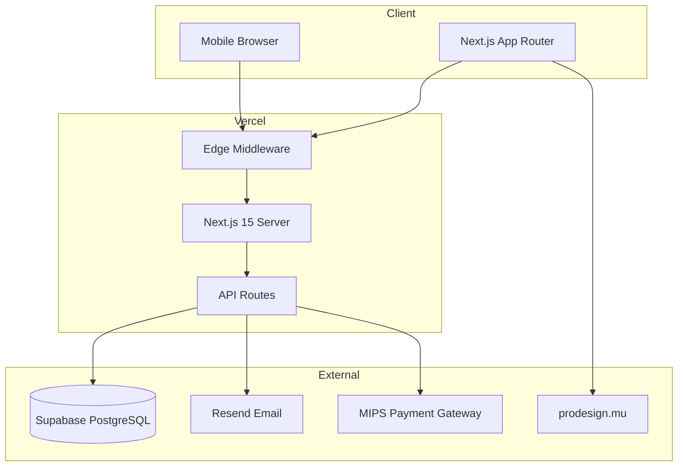
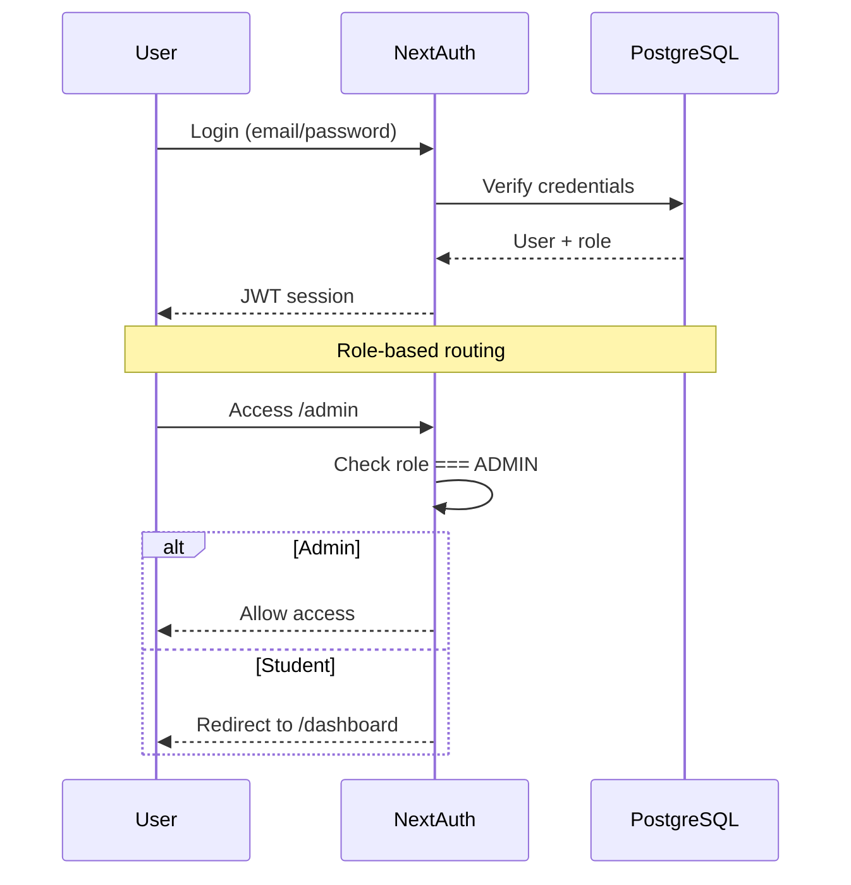
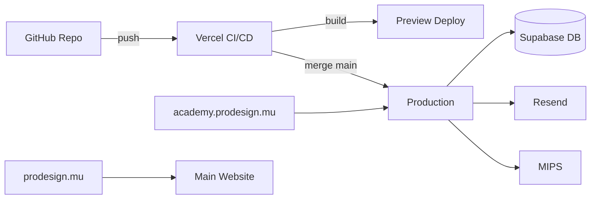

# Technical Architecture
## ProDesign Mauritius Training Academy

---

## System Overview



---

## Tech Stack

| Layer | Technology | Purpose |
|-------|-----------|---------|
| Framework | Next.js 15 (App Router) | SSR, SSG, API routes |
| Language | TypeScript | Type safety |
| Styling | TailwindCSS + ShadCN UI | Design system |
| Animation | Framer Motion | Premium animations |
| Database | PostgreSQL (Supabase) | Data persistence |
| ORM | Prisma | Database access |
| Auth | NextAuth.js v5 | Authentication |
| Email | Resend | Transactional emails |
| Payments | MIPS-ready layer | Mauritius payments |
| Validation | Zod | Schema validation |
| Forms | React Hook Form | Form management |
| Deployment | Vercel | Hosting + CI/CD |
| Analytics | Vercel Analytics | Performance tracking |

---

## Folder Structure

```
prodesign-academy/
├── docs/                          # Planning documents
├── prisma/
│   ├── schema.prisma              # Database schema
│   └── seed.ts                    # Seed data
├── public/
│   ├── images/                    # Static images
│   ├── brochures/                 # PDF brochures
│   └── logo.svg                   # ProDesign logo
├── src/
│   ├── app/
│   │   ├── (public)/              # Public route group
│   │   │   ├── page.tsx           # Homepage
│   │   │   ├── courses/
│   │   │   ├── about/
│   │   │   ├── instructor/
│   │   │   ├── faq/
│   │   │   ├── contact/
│   │   │   ├── blog/
│   │   │   ├── register/
│   │   │   ├── checkout/
│   │   │   ├── terms/
│   │   │   └── privacy/
│   │   ├── (dashboard)/
│   │   │   ├── dashboard/         # Student dashboard
│   │   │   └── admin/             # Admin dashboard
│   │   ├── api/
│   │   │   ├── auth/
│   │   │   ├── register/
│   │   │   ├── checkout/
│   │   │   ├── payments/
│   │   │   ├── contact/
│   │   │   ├── newsletter/
│   │   │   └── admin/
│   │   ├── layout.tsx
│   │   ├── sitemap.ts
│   │   └── robots.ts
│   ├── components/
│   │   ├── ui/                    # ShadCN components
│   │   ├── layout/                # Header, Footer, Nav
│   │   ├── home/                  # Homepage sections
│   │   ├── course/                # Course components
│   │   ├── forms/                 # Registration, Contact
│   │   ├── checkout/              # Payment UI
│   │   ├── dashboard/             # Dashboard components
│   │   └── shared/                # Reusable (CTA, Stats, etc.)
│   ├── lib/
│   │   ├── db.ts                  # Prisma client
│   │   ├── auth.ts                # NextAuth config
│   │   ├── email.ts               # Resend helpers
│   │   ├── payments/              # MIPS integration
│   │   ├── validations/           # Zod schemas
│   │   ├── utils.ts               # Utilities
│   │   └── constants.ts           # App constants
│   ├── hooks/                     # Custom React hooks
│   ├── types/                     # TypeScript types
│   └── styles/
│       └── globals.css
├── .env.example
├── next.config.ts
├── tailwind.config.ts
├── components.json                # ShadCN config
└── package.json
```

---

## Authentication Architecture



**Roles:** `STUDENT`, `ADMIN`  
**Session strategy:** JWT  
**Protected routes:** `/dashboard/*`, `/admin/*`

---

## Payment Architecture (MIPS-Ready)

```typescript
// lib/payments/types.ts
interface PaymentProvider {
  createSession(params: CreateSessionParams): Promise<PaymentSession>;
  verifyWebhook(payload: unknown, signature: string): boolean;
  getPaymentStatus(transactionId: string): Promise<PaymentStatus>;
}

// Implementations
class MipsProvider implements PaymentProvider { ... }
class MockProvider implements PaymentProvider { ... }  // Development
```

**Environment toggle:** `PAYMENT_PROVIDER=mips|mock`

---

## Email Architecture

| Template | Trigger | Resend Template ID |
|----------|---------|-------------------|
| registration-confirmation | POST /api/register | `registration-confirmation` |
| payment-confirmation | Payment webhook success | `payment-confirmation` |
| enrollment-confirmation | Payment webhook success | `enrollment-confirmation` |
| course-reminder | Cron (7 days before) | `course-reminder` |
| certificate-delivery | Admin marks complete | `certificate-delivery` |

All emails logged in `EmailLog` table.

---

## SEO Architecture

```typescript
// Per-page metadata via generateMetadata()
export async function generateMetadata(): Promise<Metadata> {
  return {
    title: 'Revit Course Mauritius | ProDesign Academy',
    description: '...',
    openGraph: { ... },
    alternates: { canonical: '...' },
  };
}

// JSON-LD structured data
- Organization (site-wide)
- Course (course pages)
- FAQPage (FAQ page)
- BreadcrumbList (navigation)
```

**Generated files:**
- `/sitemap.ts` → dynamic sitemap.xml
- `/robots.ts` → robots.txt

---

## Performance Strategy

| Technique | Implementation |
|-----------|---------------|
| Image optimization | next/image, WebP, lazy loading |
| Font optimization | next/font (Inter) |
| Code splitting | Dynamic imports for dashboards |
| Static generation | Homepage, course pages, blog |
| Edge caching | Vercel CDN for static assets |
| Skeleton loaders | Loading states for dynamic content |

---

## Environment Variables

```env
# Database
DATABASE_URL="postgresql://..."
DIRECT_URL="postgresql://..."

# Auth
NEXTAUTH_URL="https://training.prodesign.mu"
NEXTAUTH_SECRET="..."

# Email
RESEND_API_KEY="re_..."
EMAIL_FROM="training@prodesign.mu"

# Payments
PAYMENT_PROVIDER="mock"
MIPS_MERCHANT_ID="..."
MIPS_API_KEY="..."
MIPS_WEBHOOK_SECRET="..."
MIPS_API_URL="https://api.mips.mu"

# App
NEXT_PUBLIC_APP_URL="https://training.prodesign.mu"
NEXT_PUBLIC_MAIN_SITE_URL="https://prodesign.mu"
NEXT_PUBLIC_WHATSAPP_NUMBER="+230..."
```

---

## Deployment Architecture



---

## Security Considerations

| Area | Measure |
|------|---------|
| Auth | bcrypt password hashing, JWT expiry |
| API | Rate limiting, input validation (Zod) |
| Payments | Webhook signature verification |
| CSRF | NextAuth built-in protection |
| Headers | Security headers via next.config |
| Secrets | Environment variables only |
| SQL | Prisma parameterized queries |

---

## Scalability Path

| Stage | Architecture Change |
|-------|-------------------|
| v1 (Launch) | Single Next.js app, Supabase free tier |
| v1.5 (Growth) | Supabase Pro, Vercel Pro |
| v2 (Multi-course) | Course CMS, cohort management |
| v3 (LMS) | Video hosting (Mux/Cloudflare Stream) |
| v4 (Scale) | academy.prodesign.mu subdomain, CDN |

---

## API Route Summary

| Method | Route | Auth | Description |
|--------|-------|------|-------------|
| POST | /api/register | Public | Create registration |
| POST | /api/checkout | Student | Initiate payment |
| POST | /api/payments/webhook | MIPS | Payment callback |
| GET | /api/payments/[id] | Student | Payment status |
| GET | /api/invoices/[id] | Student | Download invoice |
| POST | /api/contact | Public | Contact form |
| POST | /api/newsletter | Public | Newsletter signup |
| GET/POST/PATCH/DELETE | /api/admin/students | Admin | Student CRUD |
| GET/POST/PATCH/DELETE | /api/admin/courses | Admin | Course CRUD |
| GET | /api/admin/analytics | Admin | Analytics data |
