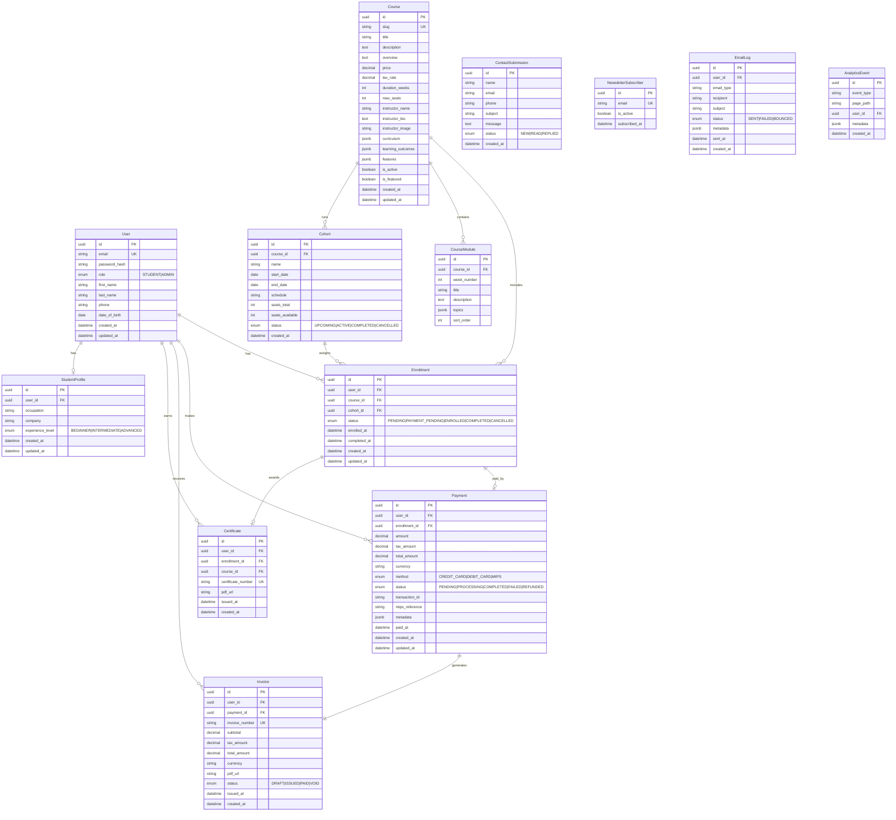

# Database Entity Relationship Diagram (ERD)
## ProDesign Mauritius Training Academy

**Database:** PostgreSQL (Supabase)  
**ORM:** Prisma

---

## Entity Relationship Diagram



---

## Table Relationships Summary

| Parent | Child | Relationship | Cascade |
|--------|-------|--------------|---------|
| User | StudentProfile | 1:1 | Delete profile on user delete |
| User | Enrollment | 1:N | Restrict if payments exist |
| User | Payment | 1:N | — |
| User | Invoice | 1:N | — |
| User | Certificate | 1:N | — |
| Course | CourseModule | 1:N | Cascade delete modules |
| Course | Cohort | 1:N | Restrict if enrollments exist |
| Course | Enrollment | 1:N | — |
| Cohort | Enrollment | 1:N | — |
| Enrollment | Payment | 1:1 | — |
| Enrollment | Certificate | 1:1 | — |
| Payment | Invoice | 1:1 | — |

---

## Key Indexes

```sql
CREATE INDEX idx_users_email ON users(email);
CREATE INDEX idx_courses_slug ON courses(slug);
CREATE INDEX idx_enrollments_user_id ON enrollments(user_id);
CREATE INDEX idx_enrollments_status ON enrollments(status);
CREATE INDEX idx_payments_status ON payments(status);
CREATE INDEX idx_payments_transaction_id ON payments(transaction_id);
CREATE INDEX idx_cohorts_start_date ON cohorts(start_date);
CREATE INDEX idx_invoices_invoice_number ON invoices(invoice_number);
```

---

## Enums

```typescript
enum UserRole { STUDENT, ADMIN }
enum ExperienceLevel { BEGINNER, INTERMEDIATE, ADVANCED }
enum EnrollmentStatus { PENDING, PAYMENT_PENDING, ENROLLED, COMPLETED, CANCELLED }
enum PaymentMethod { CREDIT_CARD, DEBIT_CARD, MIPS }
enum PaymentStatus { PENDING, PROCESSING, COMPLETED, FAILED, REFUNDED }
enum InvoiceStatus { DRAFT, ISSUED, PAID, VOID }
enum CohortStatus { UPCOMING, ACTIVE, COMPLETED, CANCELLED }
enum ContactStatus { NEW, READ, REPLIED }
enum EmailStatus { SENT, FAILED, BOUNCED }
```

---

## Sample Seed Data

| Entity | Sample |
|--------|--------|
| Course | Revit Foundation, MUR 25,000, 8 weeks, 20 seats |
| Cohort | "Cohort 1 — Aug 2026", starts 2026-08-15 |
| Admin User | admin@prodesign.mu |
| CourseModules | 8 weekly modules with topics |
