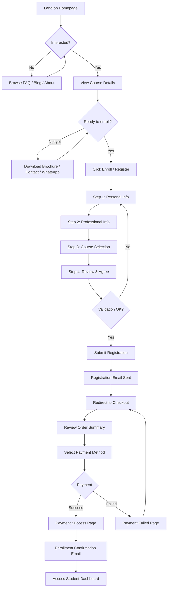
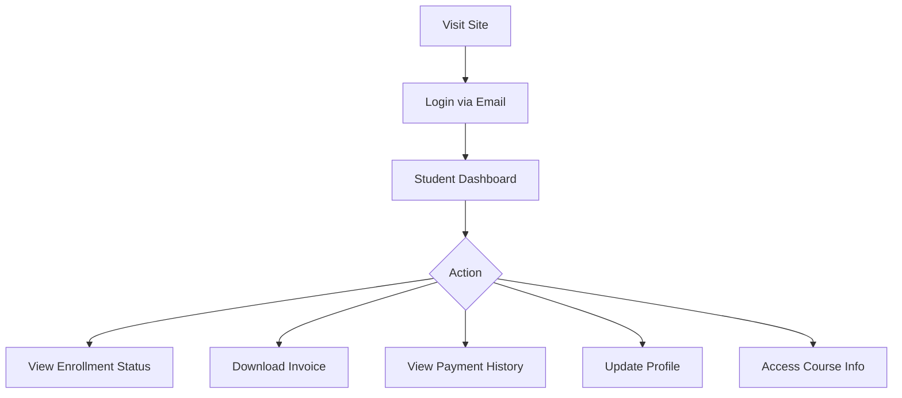
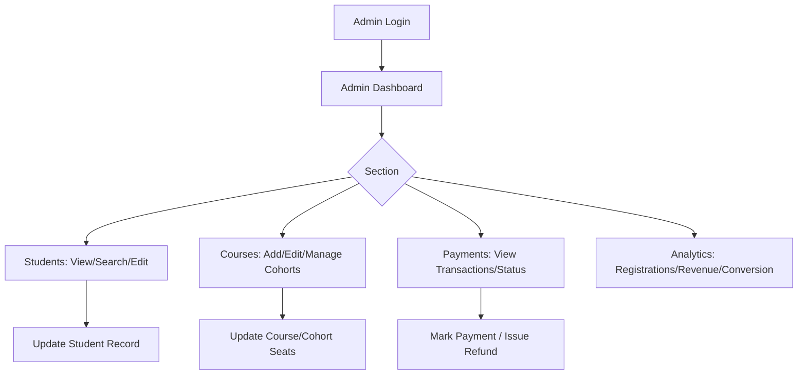
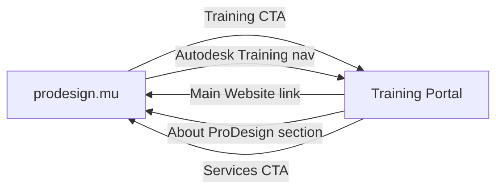
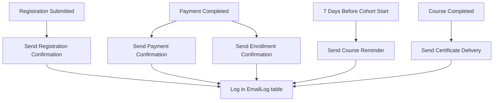
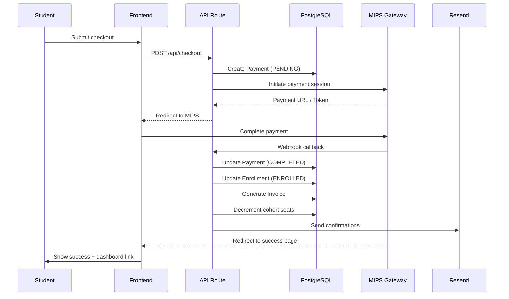

# User Flows
## ProDesign Mauritius Training Academy

---

## Flow 1: Visitor → Paid Student (Primary Conversion)

**Target time:** < 3 minutes from landing to payment success

---

## Flow 2: Returning Student

---

## Flow 3: Admin Operations

---

## Flow 4: Cross-Site Navigation

---

## Flow 5: Email Automation

---

## Flow 6: Payment (MIPS-Ready Architecture)

---

## Registration Form Steps

| Step | Fields | Validation |
|------|--------|------------|
| 1 — Personal | First name*, Last name*, Email*, Phone*, DOB* | Required, email format, phone format |
| 2 — Professional | Occupation*, Company, Experience level* | Required occupation & experience |
| 3 — Course | Course selection*, Cohort selection* | Must select active cohort with seats |
| 4 — Review | Terms agreement checkbox* | Must agree to proceed |

*Required fields

---

## Error States

| Scenario | User Experience |
|----------|-----------------|
| Cohort full | Show "Join waitlist" or next cohort option |
| Payment failed | Clear error message, retry button, support contact |
| Duplicate email | Prompt login or use different email |
| Session expired | Preserve form data, re-authenticate |
| Network error | Toast notification, retry mechanism |

---

## Mobile-Specific Considerations

- Sticky "Enroll Now" bar on course page
- Single-column form layout
- Large touch targets (min 44px)
- WhatsApp button always accessible
- Simplified checkout (Apple Pay ready architecture)
